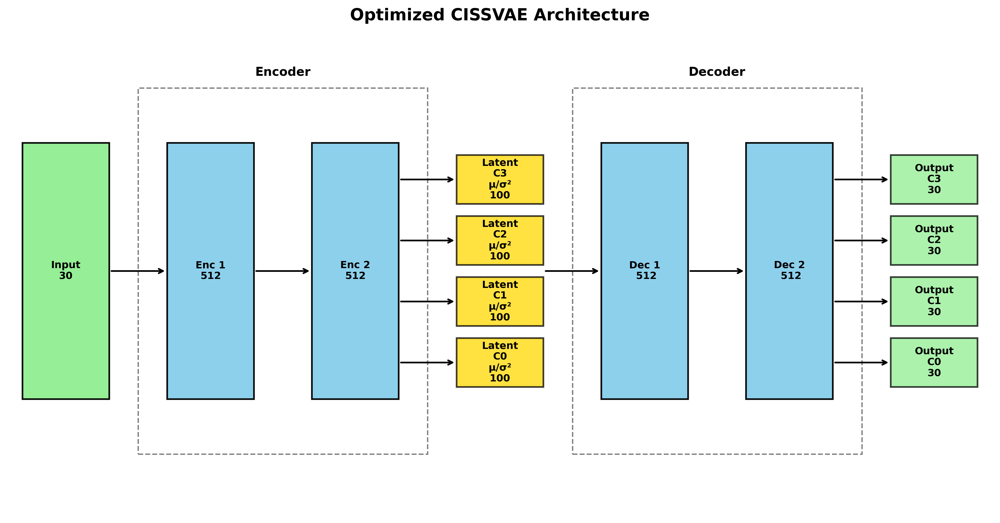

```{r setup, include=FALSE}
knitr::opts_chunk$set(
  echo = TRUE,
  warning = FALSE,
  error = FALSE,
  fig.width = 7,
  fig.height = 5,
  dpi = 600,
  collapse = TRUE,
  comment = "#>"
)

library(kableExtra)
```

## Installing package

Install devtools or remotes if not already installed: 

```{r eval=FALSE}
install.packages("remotes")
# or
install.packages("devtools")
```

The rCISSVAE package can be installed with:

```{r eval=FALSE}
remotes::install_github("CISS-VAE/rCISS-VAE")
# or
devtools::install_github("CISS-VAE/rCISS-VAE")
```

## Ensuring correct virtual environment for reticulate

This package uses `reticulate` to interface with the python version of the package `cissvae`. 
Therefore, it is necessary to make sure that you have a venv or conda environment set up that has the `cissvae` package installed. 
If you are comfortable creating an environment and installing the package, great! Then all you need to do is tell reticulate where to point. 

**For Venv**

```{r eval=FALSE}
reticulate::use_virtualenv("./.venv", required = TRUE)
```

**For conda**

```{r eval=FALSE}
reticulate::use_condaenv("myenv", required = TRUE)
```

### Virtual environment helper function 

If you do not want to manually create the virtual environment, you can use the helper function `create_cissvae_env()` to create a virtual environment (venv) in your current working directory. 

```{r eval=FALSE}
create_cissvae_env(
  envname = "cissvae_environment", ## name of environment
  path = NULL, ## add path to wherever you want virtual environment to be
  install_python = FALSE, ## set to TRUE if you want create_cisssvae_env to install python for you
  python_version = "3.10" ## set to whatever version you want >=3.10. Python 3.10 or 3.11 recommended
)
```

> **Note:** If you run into issues with create_cissvae_env(), you can create the virtual environment manually by following this [tutorial](virtual_environment_tutorial.html)

Once the environment is created, activate it using:

```{r eval=FALSE}
reticulate::use_virtualenv("./cissvae_environment", required = TRUE)
# If you used a non-default environment name then,
# reticulate::use_virtualenv("./your_environment_name", required = TRUE)
```

```{r usevenv, echo=FALSE, include=FALSE}
reticulate::use_virtualenv("/home/nfs/vaithid1/CISS-VAE/.venv", required = TRUE)
```

### (optional) Installing other python packages

If you want to install other python packages (eg seaborn) to your environment, you can use [`reticulate::virtualenv_install()`](https://rstudio.github.io/reticulate/reference/virtualenv-tools.html). 

# Quickstart

Once reticulate is pointing to the virtual environment containing the `ciss_vae` python package, you can either use the `run_cissvae` function or the `autotune_cissvae` function. 

If you know what hyperparameters you want to use for the model, use the `run_cissvae` function. 

## Run CISSVAE with Training History and Progress Tracking

Your data should be in a `DataFrame` format with optional index column. If you already have clusters you want to use, they should be in a separate vector from the dataframe. If you do not have clusters to begin with, set 'clusters' in `run_cissvae()` to NULL. 

### Example Dataset
With the rCISSVAE package comes a sample dataset with predetermined clusters. We will use this for the sake of the tutorial. 

The dataset, `df_missing` contains an index column as well as the following:

```{r show_dataset, echo=FALSE}
suppressPackageStartupMessages({
  library(tidyverse)
  library(reticulate)
  library(rCISSVAE)
  library(gtsummary)
  library(kableExtra)
})


data(df_missing)
data(clusters)

tbl_summary(df_missing, include = -"index") %>%
   kable() %>%
  kable_styling(font_size = 12)
```

Age, Salary and ZipCode columns represent demographic data with no missingness and columns Y1t-Y5t represent biomarker data obtained at different timepoints t. 


### Explanation of `run_cissvae()` Parameters

The `run_cissvae()` function is a comprehensive wrapper for all basic steps in running the CISS-VAE model, including dataset preparation, optional clustering, and running the imputation model. 

<details>
<summary> Click for a detailed explanation of all parameters </summary>

**Dataset Parameters** 
- data: A `DataFrame` containing the dataset to be imputed. Contains optional index column.   
- index_col: Name of index column to be preserved when imputing. Index column will not have any values held out for validation  
- val_proportion: Fraction of non-missing entries to hold out for validation during training. To use different proportions for each cluster, pass a vector.  
- replacement_value: Fill value for masked entries during training. Default is 0.0.   
- columns_ignore: Character or integer vector containing columns to exclude when selecting validation data. These columns will be used during training. 
- print_dataset: Set `TRUE` to print dataset summary information during processing.   

**Clustering Parameters (optional)**    
- clusters: Vector of one cluster label per row of 'data' dataframe. If NULL, will automatically determine clusters using [HDBSCAN]() or [KMeans](https://scikit-learn.org/stable/modules/generated/sklearn.cluster.KMeans.html).   
- n_clusters: Number of clusters for KMeans clustering when 'clusters' is NULL. If n_clusters is NULL, will use [HDBSCAN]() for clustering.  
- leiden_resolution: Epsilon parameter for [HDBSCAN]() clustering when automatic clustering is used.   
- missingness_proportion_matrix: Optional pre-computed missingness proportion matrix for feature-based clustering. If provided, clustering will be based on these proportions instead of direct 0/1 missingness pattern.    
- scale_features: Set `TRUE` to scale features when using missingness proportion matrix clustering.  

**Model Parameters**  
- hidden_dims: A vector containing the sizes of hidden layers in encoder/decoder. The length of this vector determines number of hidden layers.   
- latent_dim: The dimension of the latent space representation.  
- layer_order_enc: A vector stating the pattern of 'shared' and 'unshared' layers for the encoder. The length must match `length(hidden_dims)`. Default c('unshared', 'unshared', 'unshared').  
- layer_order_dec: A vector stating the pattern of 'shared' and 'unshared' layers for the decoder. The length must match `length(hidden_dims)`. Default c('shared', 'shared', 'shared').  
- latent_shared: Whether latent space weights are shared across clusters. If FALSE, will have separate latent weights for each cluster.  
- ouput_shared: If FALSE, will have separate output layer for each cluster.  
- batch_size: Integer. Mini-batch size for training. Larger values may improve training stability but require more memory.  
- return_model: If TRUE, returns the model object. Set TRUE to use `plot_vae_architecture()` after running.  
- epochs: Number of epochs for initial training phase  
- initial_lr: Initial learning rate for optimizer.   
- decay_factor: Exponential decay factor for learning rate.  
- beta: Weight for KL divergence term in VAE loss function.   
- device: Device specification for computation ("cpu" or "cuda"). If NULL, automatically selects best available device.  
- max-loops: Max number of impute-refit loops to perform.   
- patience: Training stops if validation loss doesn't improve for this many consecutive impute-refit loops.   
- epochs-per-loop: Number of epochs per refit loop. If null, uses same value as `epochs`. Default NULL.  
- decay_factor_refit: Decay factor for refit loops. If NULL, uses same value as decay_factor. Default NULL.  
- beta_refit: KL weight for refit loops. If NULL, uses same value as beta. Default NULL.  

**Optional Parameters**  
- verbose: Set `TRUE` to print MSE for each loop as it runs.
- return_silhouettes: If clusters not given, will return silhouette scores for automatic clustering.
- return_history: If `TRUE`, returns training history as data.frame. Good for checking for overfitting. 
- return_dataset: If `TRUE`, returns ClusterDataset object. 


</details>


### Running the imputation

To run the imputation model, first load your data. You can use the `cluster_summary()` function to visualize the missingness by cluster. 

```{r eval=FALSE, message=FALSE, warning=FALSE}
suppressPackageStartupMessages({
  library(tidyverse)
  library(reticulate)
  library(rCISSVAE)
})

## Set correct virtualenv
reticulate::use_virtualenv("./cissvae_environment", required = TRUE)

## Load the data
data(df_missing)
data(clusters) ## actual cluster labels in clusters$clusters (other column is index)

cluster_summary(df_missing, clusters$clusters, index_col = "index")  %>% kable()  %>%
  kable_styling(font_size = 12)
```

```{r showruncissvae2, echo=FALSE}
library(tidyverse)
library(reticulate)
library(rCISSVAE)
library(kableExtra)

data(df_missing)
data(clusters)

cluster_summary(df_missing, clusters$clusters, index_col = "index")  %>% kable()  %>%
  kable_styling(font_size = 12)

```

Then, plug your data and clusters into the `run_cissvae()` function. 

```{r eval=FALSE, message=FALSE, warning=FALSE}
## Run the imputation model. 
dat = run_cissvae(
  data = df_missing,
  index_col = "index",
  val_proportion = 0.1, ## pass a vector for different proportions by cluster
  columns_ignore = c("Age", "Salary", "ZipCode10001", "ZipCode20002", "ZipCode30003"), ## If there are columns in addition to the index you want to ignore when selecting validation set, list them here. In this case, we ignore the 'demographic' columns because we do not want to remove data from them for validation purposes. 
  clusters = clusters$clusters, ## we have precomputed cluster labels so we pass them here
  epochs = 500,
  return_silhouettes = FALSE,
  return_history = TRUE,  # Get detailed training history
  verbose = FALSE,
  return_model = TRUE, ## Allows for plotting model schematic
  device = "cpu",  # Explicit device selection
  layer_order_enc = c("unshared", "shared", "unshared"),
  layer_order_dec = c("shared", "unshared", "shared")
)

## Retrieve results
imputed_df <- dat$imputed
silhouette <- dat$silhouettes
training_history <- dat$history  # Detailed training progress

## Plot training progress
if (!is.null(training_history)) {
  plot(training_history$epoch, training_history$loss, 
       type = "l", main = "Training Loss Over Time", 
       xlab = "Epoch", ylab = "Loss")
}

plot_vae_architecture(model = dat$model, save_path = "test_plot_arch.png")
```

```{r showruncissvae, echo=FALSE}
dat = run_cissvae(
  data = df_missing,
  index_col = "index",
  val_proportion = 0.1, ## pass a vector for different proportions by cluster
  columns_ignore = c("Age", "Salary", "ZipCode10001", "ZipCode20002", "ZipCode30003"), ## If there are columns in addition to the index you want to ignore when selecting validation set, list them here. In this case, we ignore the 'demographic' columns because we do not want to remove data from them for validation purposes. 
  clusters = clusters$clusters, ## we have precomputed cluster labels so we pass them here
  epochs = 5,
  return_silhouettes = FALSE,
  return_history = TRUE,  # Get detailed training history
  verbose = FALSE,
  return_model = TRUE, ## Allows for plotting model schematic
  device = "cpu",  # Explicit device selection
  layer_order_enc = c("unshared", "shared", "unshared"),
  layer_order_dec = c("shared", "unshared", "shared")
)

## Retrieve results
imputed_df <- dat$imputed
silhouette <- dat$silhouettes
training_history <- dat$history

## Plot training progress
if (!is.null(training_history)) {
  plot(training_history$epoch, training_history$loss, 
       type = "l", main = "Training Loss Over Time", 
       xlab = "Epoch", ylab = "Loss")
}

## Plot model architecture
plot_vae_architecture(model = dat$model, save_path = "test_plot_arch.png")
```


## Clustering Features by Missingness Patterns

Before running CISS-VAE, you can cluster features based on their missingness patterns. This helps identify features that tend to be missing together systematically, which can improve imputation quality.

```{r clusfeatmissing}
library(rCISSVAE)

data(df_missing)


cluster_result <- cluster_on_missing(
  data = df_missing,
  cols_ignore =  c("index", "Age", "Salary", "ZipCode10001", "ZipCode20002", "ZipCode30003"),
  n_clusters = 4,  # Use KMeans with 4 clusters
  seed = 42
)

cluster_summary(df_missing, cluster_result$clusters, index_col = "index")  %>% kable() %>%
  kable_styling(font_size = 12)
cat(paste("Clustering quality (silhouette):", round(cluster_result$silhouette, 3)))


result <- run_cissvae(
  data = df_missing,
  index_col = "index",
  clusters = cluster_result$clusters,
  epochs = 5, ## short run for demo purposes
  return_history = TRUE,
  verbose = FALSE,
  device = "cpu"
)
```


## Advanced Hyperparameter Optimization with Autotune

### Understanding Parameter Types

For hyperparameter optimization in `autotune_cissvae()`, parameters can be specified as:

- **Fixed value**: `beta = 0.01` → parameter remains constant across trials
- **Categorical choice**: `c(64, 128, 256)` → Optuna selects from the provided options
- **Integer range**: `c(1, 4)` → Optuna suggests integers between 1 and 4 (inclusive)
- **Float range**: `reticulate::tuple(1e-4, 1e-3)` → Optuna suggests floats in the specified range

#### Layer Placement Strategies

The layer arrangement strategies control how shared and unshared layers are positioned:

- **`"at_end"`**: Places shared layers at the end of the encoder or start of the decoder
- **`"at_start"`**: Places shared layers at the start of the encoder or end of the decoder  
- **`"alternating"`**: Distributes shared layers evenly throughout the architecture
- **`"random"`**: Uses random placement of shared layers (with reproducible seed)

```{r eval=FALSE}
library(tidyverse)
library(reticulate)
library(rCISSVAE)
reticulate::use_virtualenv("./cissvae_environment", required = TRUE)

data(df_missing)
data(clusters)

aut <- autotune_cissvae(
  data = df_missing,
  index_col = "index",
  clusters = clusters$clusters,
  save_model_path = NULL,
  save_search_space_path = NULL,
  n_trials = 3, ## Using low number of trials for demo
  study_name = "comprehensive_vae_autotune",
  device_preference = "cpu",
  show_progress = FALSE,  # Set true for Rich progress bars with training visualization
  optuna_dashboard_db = "sqlite:///optuna_study.db",  # Save results to database
  load_if_exists = FALSE, ## Set true to load and continue study if it exists
  seed = 42, 
  verbose = FALSE,
  
  # Search strategy options
  constant_layer_size = FALSE,     # Allow different sizes per layer
  evaluate_all_orders = FALSE,     # Sample layer arrangements efficiently
  max_exhaustive_orders = 100,     # Limit for exhaustive search
  
  ## Hyperparameter search space
  num_hidden_layers = c(2, 5),     # Try 2-5 hidden layers
  hidden_dims = c(64, 512),        # Layer sizes from 64 to 512
  latent_dim = c(10, 100),         # Latent dimension range
  latent_shared = c(TRUE, FALSE),
  output_shared = c(TRUE, FALSE),
  lr = 0.01,  # Learning rate range
  decay_factor = 0.99,
  beta = 0.01,  # KL weight range
  num_epochs = 500,                # Fixed epochs for demo
  batch_size = c(1000, 4000),     # Batch size options
  num_shared_encode = c(0, 1, 2, 3),
  num_shared_decode = c(0, 1, 2, 3),
  
  # Layer placement strategies - try different arrangements
  encoder_shared_placement = c("at_end", "at_start", "alternating", "random"),
  decoder_shared_placement = c("at_start", "at_end", "alternating", "random"),
  
  refit_patience = 2,        # Early stopping patience
  refit_loops = 100,                # Fixed refit loops
  epochs_per_loop = 100,   # Epochs per refit loop
  reset_lr_refit = c(TRUE, FALSE)
)

# Analyze results
imputed <- aut$imputed
best_model <- aut$model
study <- aut$study
results <- aut$results

# View best hyperparameters
cat("Best validation MSE:", study$best_value, "\n")
print("Trial results:")
results %>% kable() %>%
  kable_styling(font_size=12)

# Plot model architecture
plot_vae_architecture(best_model, title = "Optimized CISSVAE Architecture")
```

```{r show_autotune, echo=FALSE}
library(tidyverse)
library(reticulate)
library(rCISSVAE)

data(df_missing)
data(clusters)

aut <- autotune_cissvae(
  data = df_missing,
  index_col = "index",
  clusters = clusters$clusters,
  save_model_path = NULL,
  save_search_space_path = NULL,
  n_trials = 3, ## Using low number of trials for demo
  study_name = "comprehensive_vae_autotune",
  device_preference = "cpu",
  show_progress = FALSE,  # Rich progress bars with training visualization
  optuna_dashboard_db = "sqlite:///optuna_study.db",  # Save results to database
  load_if_exists = TRUE,
  seed = 42, 
  verbose = FALSE,
  
  # Search strategy options
  constant_layer_size = FALSE,     # Allow different sizes per layer
  evaluate_all_orders = FALSE,     # Sample layer arrangements efficiently
  max_exhaustive_orders = 100,     # Limit for exhaustive search
  
  ## Hyperparameter search space
  num_hidden_layers = c(2, 5),     # Try 2-5 hidden layers
  hidden_dims = c(64, 512),        # Layer sizes from 64 to 512
  latent_dim = c(10, 100),         # Latent dimension range
  latent_shared = c(TRUE, FALSE),
  output_shared = c(TRUE, FALSE),
  lr = 0.01,  # Learning rate range
  decay_factor = 0.99,
  beta = 0.01,  # KL weight range
  num_epochs = 5,                # Fixed epochs for demo
  batch_size = c(1000, 4000),     # Batch size options
  num_shared_encode = c(0, 1, 2, 3),
  num_shared_decode = c(0, 1, 2, 3),
  
  # Layer placement strategies - try different arrangements
  encoder_shared_placement = c("at_end", "at_start", "alternating", "random"),
  decoder_shared_placement = c("at_start", "at_end", "alternating", "random"),
  
  refit_patience = 2,        # Early stopping patience
  refit_loops = 100,                # Fixed refit loops
  epochs_per_loop = 5,   # Epochs per refit loop
  reset_lr_refit = TRUE
)

imputed <- aut$imputed
best_model <- aut$model
study <- aut$study
results <- aut$results

cat("Best validation MSE:", study$best_value, "\n")
print("Trial results:")
results %>% kable() %>%
  kable_styling(font_size=12)

plot_vae_architecture(best_model, title = "Optimized CISSVAE Architecture", save_path = "autotune_vae_arch.png")
```




```{r useprecompmissingprop, eval=TRUE, echo = TRUE}
## Using Pre-computed Missingness Proportion Matrix -- not quite working yet

##For advanced control over the clustering process, you can provide a pre-computed missingness proportion matrix directly to `run_cissvae()`:

## Standardize df_missing column names to feature_timepoint format
colnames(df_missing) = c('index', 'Age', 'Salary', 'ZipCode10001', 'ZipCode20002', 'ZipCode30003', 'Y1_1', 'Y1_2', 'Y1_3', 'Y1_4', 'Y1_5', 'Y2_1', 'Y2_2', 'Y2_3', 'Y2_4', 'Y2_5', 'Y3_1', 'Y3_2', 'Y3_3', 'Y3_4', 'Y3_5', 'Y4_1', 'Y4_2', 'Y4_3', 'Y4_4', 'Y4_5', 'Y5_1', 'Y5_2', 'Y5_3', 'Y5_4', 'Y5_5')

# Create and examine missingness proportion matrix
prop_matrix <- create_missingness_prop_matrix(df_missing, 
index_col = "index", 
cols_ignore = c('Age', 'Salary', 'ZipCode10001', 'ZipCode20002', 'ZipCode30003'),
repeat_feature_names = c("Y1", "Y2", "Y3", "Y4", "Y5"))


print("Missingness proportion matrix dimensions:")
print(dim(prop_matrix))
print("Sample of proportion matrix:")
print(head(prop_matrix[, 1:5]))

# Use proportion matrix with scaling for better clustering
advanced_result <- run_cissvae(
  data = df_missing,
  index_col = "index",
  clusters = NULL,  # Let function cluster using prop_matrix
  columns_ignore = c('Age', 'Salary', 'ZipCode10001', 'ZipCode20002', 'ZipCode30003'), 
  missingness_proportion_matrix = prop_matrix,
  scale_features = TRUE,  # Standardize features before clustering
  n_clusters = 4,
  leiden_resolution = 0.1,  # HDBSCAN parameter
  epochs = 5,
  return_history = TRUE,
  return_silhouettes = TRUE,
  device = "cpu",
  verbose = FALSE
)

print("Clustering quality:")
print(paste("Silhouette score:", round(advanced_result$silhouette_width, 3)))

# Plot training history
if (!is.null(advanced_result$history)) {
  plot(advanced_result$history$epoch, advanced_result$history$val_mse, 
       type = "l", main = "Validation MSE During Training", 
       xlab = "Epoch", ylab = "Validation MSE")
}
```

```{r show_missingpropmatrix, echo=FALSE, eval=FALSE}
prop_matrix <- create_missingness_prop_matrix(df_missing, index_col = "index")
print("Missingness proportion matrix dimensions:")
print(dim(prop_matrix))
print("Sample of proportion matrix:")
print(head(prop_matrix[, 1:5]))

advanced_result <- run_cissvae(
  data = df_missing,
  index_col = "index",
  clusters = NULL,
  missingness_proportion_matrix = prop_matrix,
  scale_features = TRUE,
  n_clusters = 4,
  epochs = 5,  # Reduced for demo
  return_history = TRUE,
  return_silhouettes = TRUE,
  device = "cpu",
  verbose = FALSE
)

print("Clustering quality:")
print(paste("Silhouette score:", round(advanced_result$silhouettes, 3)))

if (!is.null(advanced_result$history)) {
  plot(advanced_result$history$epoch, advanced_result$history$val_mse, 
       type = "l", main = "Validation MSE During Training", 
       xlab = "Epoch", ylab = "Validation MSE")
}
```


